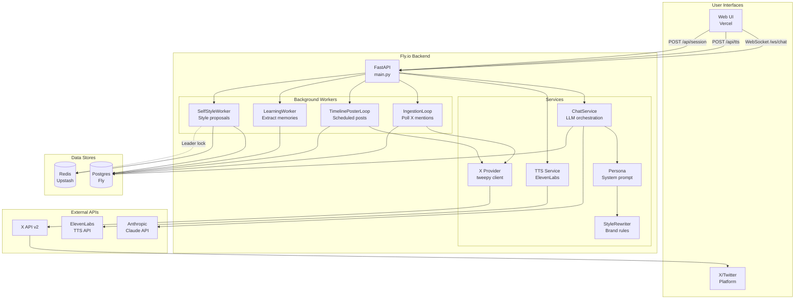

# Jeffrey AIstein - System Map

**Last Updated:** 2026-02-03

This document provides a high-level architecture overview of the Jeffrey AIstein system.

---

## Infrastructure Overview

| Component | Platform | URL/Location | Purpose |
|-----------|----------|--------------|---------|
| **Web Frontend** | Vercel | `jeffreyaistein.vercel.app` | React/Next.js UI with chat, hologram avatar, TTS |
| **API Backend** | Fly.io | `jeffreyaistein.fly.dev` | FastAPI server, WebSocket, schedulers |
| **Database** | Fly Postgres | (internal) | Conversations, memories, X bot data, corpus |
| **Cache/Locking** | Upstash Redis | (Fly secret) | Leader election for workers, rate limiting |
| **LLM** | Anthropic | External API | Claude 3.5 Sonnet for chat/generation |
| **TTS** | ElevenLabs | External API | Voice synthesis for avatar |
| **Social** | X/Twitter | External API | @JeffreyAIstein bot |

---

## Architecture Diagram



---

## Data Flow: Web Chat

```
User Browser → Vercel (Next.js) → Fly.io API → Claude → Response
     ↓              ↓                 ↓
  [TTS audio]  [Static assets]  [Postgres: conversations, messages]
```

1. **Session Init**: `POST /api/session` creates anonymous user, sets cookie
2. **WebSocket Connect**: `/ws/chat?conversation_id=...` establishes streaming connection
3. **Message Flow**:
   - User sends `{"type": "message", "content": "..."}`
   - API saves user message to `messages` table
   - ChatService builds system prompt (persona + style rules)
   - Streams response from Claude via Anthropic API
   - Saves assistant message to `messages` table
   - Client receives `content_delta` events
4. **TTS Synthesis**: After message complete, frontend calls `POST /api/tts`
   - ElevenLabs generates MP3
   - Audio plays, drives avatar mouth amplitude

---

## Data Flow: X Bot

```
X Platform → IngestionLoop → Postgres → TimelinePosterLoop → X Platform
                                ↓
                         LearningWorker
                                ↓
                         Memories table
```

1. **Ingestion** (every 45s when `X_BOT_ENABLED=true`):
   - `IngestionLoop` polls X API for mentions
   - New tweets stored in `x_inbox` table
   - Scorer evaluates quality/relevance
   - High-quality tweets get draft replies generated

2. **Draft Approval** (when `APPROVAL_REQUIRED=true`):
   - Drafts stored in `x_drafts` with `status=pending`
   - Admin reviews via `GET /api/admin/social/drafts`
   - Approve: `POST /api/admin/social/drafts/{id}/approve` → posts to X
   - Reject: `POST /api/admin/social/drafts/{id}/reject`

3. **Timeline Posts** (every 3 hours):
   - `TimelinePosterLoop` generates organic timeline content
   - Subject to hourly/daily rate limits
   - Blocked if `SAFE_MODE=true`

4. **Learning Extraction**:
   - `LearningWorker` processes posted content
   - Extracts: slang/phrases, narrative tags, engagement outcomes, risk flags
   - Stores in `memories` table with `type LIKE 'x_%'`

---

## Data Flow: Self-Style Proposals

```
x_posts table → SelfStyleWorker → style_guide_versions → Admin activation → StyleRewriter
                     ↓
              Redis leader lock
```

1. **Worker Runs** (every 24h when `SELF_STYLE_ENABLED=true`):
   - Requires Redis leader lock (prevents duplicates across instances)
   - Queries last 30 days of AIstein's posted tweets from `x_posts`
   - Skips if tweet count < 25

2. **Analysis**:
   - Analyzes vocabulary, sentence structure, formatting patterns
   - Generates derived style rules

3. **Proposal Creation**:
   - Saves versioned files: `STYLE_GUIDE_DERIVED_{version}.md` and `.json`
   - Inserts row in `style_guide_versions` with `is_active=false`
   - **NEVER auto-activates** - requires admin approval

4. **Admin Activation**:
   - `GET /api/admin/persona/style/versions` lists proposals
   - `POST /api/admin/persona/style/activate` activates a version
   - Validates hard constraints (0 emojis, 0 hashtags) before activation
   - Reloads `StyleRewriter` in-process

---

## Data Flow: Corpus Ingestion (Epstein)

```
data/raw/epstein/* → ingest_epstein_corpus.py → ContentSanitizer → knowledge_documents
                                                      ↓
                                              Tone extraction
                                                      ↓
                                              epstein_tone.json
```

1. **Ingestion** (manual CLI):
   - `python scripts/ingest_epstein_corpus.py --sources doj_releases`
   - Reads PDF/JSON files from `data/raw/epstein/`
   - `ContentSanitizer` blocks names, victims, PII
   - Only sanitized summaries stored in `knowledge_documents`

2. **Tone Building**:
   - `POST /api/admin/persona/rebuild` triggers tone extraction
   - Analyzes word frequencies, themes from sanitized summaries
   - Saves to `services/persona/epstein_tone.json`

3. **Persona Blending**:
   - `EPSTEIN_PERSONA_BLEND=true` enables casefile parody cadence
   - `EPSTEIN_MODE=false` (always) - no retrieval of raw content
   - Tone influences vocabulary, not content

---

## Entry Points Summary

### Web Routes (Vercel)
| Route | Component | Purpose |
|-------|-----------|---------|
| `/` | `page.tsx` | Main UI with chat, avatar, token panels |

### API Endpoints (Fly.io)

**Public:**
| Endpoint | Method | Purpose |
|----------|--------|---------|
| `/` | GET | Health check |
| `/health` | GET | Basic health |
| `/health/ready` | GET | Dependency health (DB, Redis, X bot) |
| `/api/session` | POST | Create/validate session |
| `/api/conversations` | GET/POST | List/create conversations |
| `/api/chat` | POST | SSE chat (fallback) |
| `/api/tts` | POST | Text-to-speech synthesis |
| `/api/tts/status` | GET | TTS configuration status |
| `/ws/chat` | WebSocket | Streaming chat |

**Admin (requires `X-Admin-Key`):**
| Endpoint | Method | Purpose |
|----------|--------|---------|
| `/api/admin/social/status` | GET | X bot scheduler stats |
| `/api/admin/social/drafts` | GET | List pending drafts |
| `/api/admin/social/drafts/{id}/approve` | POST | Approve and post |
| `/api/admin/social/drafts/{id}/reject` | POST | Reject draft |
| `/api/admin/social/settings` | GET/PATCH | Runtime settings |
| `/api/admin/persona/status` | GET | Persona/style status |
| `/api/admin/persona/rebuild` | POST | Rebuild compiled persona |
| `/api/admin/persona/style/versions` | GET | List style proposals |
| `/api/admin/persona/style/activate` | POST | Activate proposal |
| `/api/admin/persona/style/rollback` | POST | Rollback to previous |
| `/api/admin/persona/style/generate` | POST | Manually trigger proposal |
| `/api/admin/learning/status` | GET | Learning persistence stats |
| `/api/admin/learning/recent` | GET | Recent extracted memories |
| `/api/admin/corpus/epstein/status` | GET | Corpus ingestion status |
| `/api/admin/corpus/epstein/enable` | POST | Enable EPSTEIN_MODE |
| `/api/admin/corpus/epstein/disable` | POST | Disable EPSTEIN_MODE |

### Background Workers (Fly.io lifespan)

| Worker | Trigger | Interval | Purpose |
|--------|---------|----------|---------|
| `IngestionLoop` | `X_BOT_ENABLED=true` | 45s | Poll X mentions |
| `TimelinePosterLoop` | `X_BOT_ENABLED=true` | 3h | Organic posts |
| `LearningWorker` | `X_BOT_ENABLED=true` | 5m | Extract memories |
| `SelfStyleWorker` | `SELF_STYLE_ENABLED=true` | 24h | Style proposals |

### CLI Scripts (manual)

| Script | Purpose |
|--------|---------|
| `scripts/ingest_epstein_corpus.py` | Ingest DOJ documents |
| `scripts/build_style_guide.py` | Build style from KOL tweets |
| `scripts/propose_style_guide.py` | Generate style proposal |
| `scripts/test_style_output.py` | Test persona output |
| `scripts/verify_learning_persistence.py` | Verify DB persistence |
| `scripts/verify_x_credentials.py` | Test X API credentials |

---

## Database Tables

### Core (Phase 1)
- `users` - Anonymous and authenticated users
- `conversations` - Chat threads
- `messages` - Chat messages
- `events` - Episodic event log

### Memory (Phase 4)
- `memories` - Semantic memories (facts, preferences, learning extracts)
- `summaries` - Compressed context
- `retrieval_traces` - Memory retrieval audit

### Token (Phase 5)
- `token_metrics` - Current price/mcap
- `token_ath` - ATH tracking
- `token_snapshots` - Historical data

### Social/X Bot (Phase 8)
- `x_inbox` - Ingested mentions
- `x_posts` - AIstein's posts
- `x_drafts` - Pending approval
- `x_threads` - Thread tracking
- `x_reply_log` - Reply rate limiting
- `x_settings` - Runtime settings

### Style Versions (Phase 10)
- `style_guide_versions` - Versioned style proposals

### Knowledge (Phase 11)
- `knowledge_documents` - Ingested corpus documents

---

## Safe Mode Posture

**Default production state:**
- `SAFE_MODE=false` - Posting enabled
- `APPROVAL_REQUIRED=true` - Human approval for all posts
- `EPSTEIN_MODE=false` - No corpus retrieval
- `EPSTEIN_PERSONA_BLEND=false` - No parody cadence
- `X_BOT_ENABLED=false` - X bot disabled until explicitly enabled

**Kill switch:**
- `PATCH /api/admin/social/settings {"safe_mode": true}` - Stops all posting immediately
- Stored in DB, takes effect without restart

---

## Key Safety Constraints

1. **Brand Rules** (enforced at generation + post-processing):
   - 0% emojis allowed
   - 0% hashtags allowed
   - Validated before style activation

2. **Content Sanitization**:
   - `ContentSanitizer` blocks: names, victims, PII, explicit content
   - Only sanitized summaries stored

3. **Approval Gates**:
   - X drafts require admin approval
   - Style proposals require admin activation
   - Corpus retrieval requires admin enable

4. **Rate Limiting**:
   - X: 5/hour, 20/day post limits
   - TTS: 10 requests/minute per IP
   - Chat: 20 messages/minute

5. **Leader Locking**:
   - `SelfStyleWorker` uses Redis lock to prevent duplicate proposals
   - Refuses to run without Redis configured
